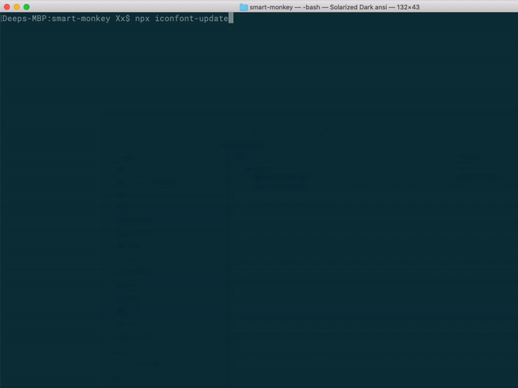

在微信小程序开发中，使用 iconfont 需要引用本地的文件。每次 iconfont 项目发生变更时，需要去下载最新的 css 文件，并且还要手动删除掉里面对于小程序无用的 src url(*) 兼容节点，然后保存为 wxss 文件。整个过程比较繁琐，这个小工具可以帮你自动完成这些工作。


## 运行效果




## 使用指南

### 安装

```shell
npm i -D mp-iconfont-cli
```

> 请安装 Node.js 8+ 版本。


### 使用范例

目前仅支持 Github 账号登录 iconfont，在项目根目录下运行：

```shell
npx iconfont-update
```

运行过程中会列出 iconfont 中我的项目列表，选择你需要的项目，按照后面的提示操作即可。


#### 清除设定值

第一次运行完毕后，工具会记住你的选项，下次再运行时无需重复输入了。如果需要清除输入过的设定值，运行下面的命令：

```shell
npx iconfont-update --clear
```


#### 显示详细错误内容

有时由于网络不太好或者其他情况会出现异常错误，如需要显示详细的异常信息，请在运行时加上选项 `--trace`：

```shell
npx iconfont-update --trace
```


## 设计思路

- 使用 [puppeteer](https://github.com/puppeteer/puppeteer) 模拟网页交互
- 使用 [inquirer](https://github.com/SBoudrias/Inquirer.js) 和 [ora](https://github.com/sindresorhus/ora) 增强 CLI 交互
- 使用 [css-tree](https://github.com/csstree/csstree) 处理 CSS AST
- 使用 [configstore](https://github.com/yeoman/configstore) 保存用户设定值
